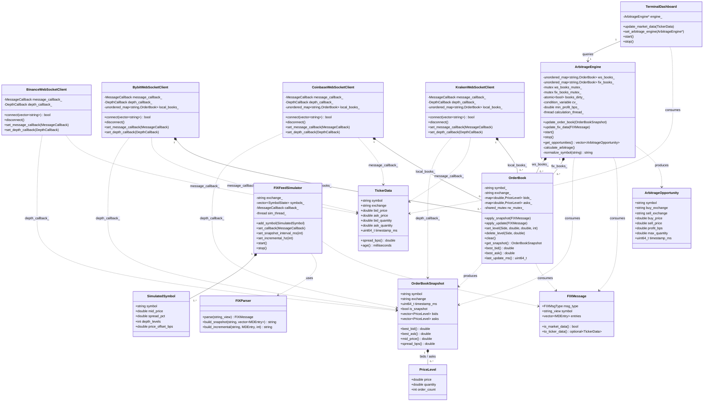

# TickPlant — Class Structure (UML)

```mermaid
classDiagram
    direction TB

    %% ── Data Structures ──────────────────────────────────────────────────
    class PriceLevel {
        +double price
        +double quantity
        +int order_count
    }

    class OrderBookSnapshot {
        +string symbol
        +string exchange
        +uint64_t timestamp_ms
        +bool is_snapshot
        +vector~PriceLevel~ bids
        +vector~PriceLevel~ asks
        +best_bid() double
        +best_ask() double
        +mid_price() double
        +spread_bps() double
    }

    class TickerData {
        +string symbol
        +string exchange
        +double bid_price
        +double ask_price
        +double bid_quantity
        +double ask_quantity
        +uint64_t timestamp_ms
        +spread_bps() double
        +age() milliseconds
    }

    class ArbitrageOpportunity {
        +string symbol
        +string buy_exchange
        +string sell_exchange
        +double buy_price
        +double sell_price
        +double profit_bps
        +double max_quantity
        +uint64_t timestamp_ms
    }

    class FIXMessage {
        +FIXMsgType msg_type
        +string_view symbol
        +vector~MDEntry~ entries
        +is_market_data() bool
        +to_ticker_data() optional~TickerData~
    }

    class SimulatedSymbol {
        +string symbol
        +double mid_price
        +double spread_pct
        +int depth_levels
        +double price_offset_bps
    }

    %% ── Core ─────────────────────────────────────────────────────────────
    class FIXParser {
        +parse(string_view) FIXMessage
        +build_snapshot(string, vector~MDEntry~) string
        +build_incremental(string, MDEntry, int) string
    }

    class OrderBook {
        -string symbol_
        -string exchange_
        -map~double,PriceLevel~ bids_
        -map~double,PriceLevel~ asks_
        -shared_mutex rw_mutex_
        +apply_snapshot(FIXMessage)
        +apply_update(FIXMessage)
        +set_level(Side, double, double, int)
        +delete_level(Side, double)
        +clear()
        +get_snapshot() OrderBookSnapshot
        +best_bid() double
        +best_ask() double
        +last_update_ms() uint64_t
    }

    %% ── Exchange Clients ─────────────────────────────────────────────────
    class BinanceWebSocketClient {
        -MessageCallback message_callback_
        -DepthCallback depth_callback_
        +connect(vector~string~) bool
        +disconnect()
        +set_message_callback(MessageCallback)
        +set_depth_callback(DepthCallback)
    }

    class BybitWebSocketClient {
        -MessageCallback message_callback_
        -DepthCallback depth_callback_
        -unordered_map~string,OrderBook~ local_books_
        +connect(vector~string~) bool
        +disconnect()
        +set_message_callback(MessageCallback)
        +set_depth_callback(DepthCallback)
    }

    class CoinbaseWebSocketClient {
        -MessageCallback message_callback_
        -DepthCallback depth_callback_
        -unordered_map~string,OrderBook~ local_books_
        +connect(vector~string~) bool
        +disconnect()
        +set_message_callback(MessageCallback)
        +set_depth_callback(DepthCallback)
    }

    class KrakenWebSocketClient {
        -MessageCallback message_callback_
        -DepthCallback depth_callback_
        -unordered_map~string,OrderBook~ local_books_
        +connect(vector~string~) bool
        +disconnect()
        +set_message_callback(MessageCallback)
        +set_depth_callback(DepthCallback)
    }

    class FIXFeedSimulator {
        -string exchange_
        -vector~SymbolState~ symbols_
        -MessageCallback callback_
        -thread sim_thread_
        +add_symbol(SimulatedSymbol)
        +set_callback(MessageCallback)
        +set_snapshot_interval_ms(int)
        +set_incremental_hz(int)
        +start()
        +stop()
    }

    %% ── Engine ───────────────────────────────────────────────────────────
    class ArbitrageEngine {
        -unordered_map~string,OrderBook~ ws_books_
        -unordered_map~string,OrderBook~ fix_books_
        -mutex ws_books_mutex_
        -mutex fix_books_mutex_
        -atomic~bool~ books_dirty_
        -condition_variable cv_
        -double min_profit_bps_
        -thread calculation_thread_
        +update_order_book(OrderBookSnapshot)
        +update_fix_data(FIXMessage)
        +start()
        +stop()
        +get_opportunities() vector~ArbitrageOpportunity~
        -calculate_arbitrage()
        -normalize_symbol(string) string
    }

    %% ── Dashboard ────────────────────────────────────────────────────────
    class TerminalDashboard {
        -ArbitrageEngine* engine_
        +update_market_data(TickerData)
        +set_arbitrage_engine(ArbitrageEngine*)
        +start()
        +stop()
    }

    %% ── Relationships ────────────────────────────────────────────────────

    OrderBookSnapshot "1" *-- "0..*" PriceLevel : bids / asks

    OrderBook ..> OrderBookSnapshot : produces
    OrderBook ..> FIXMessage        : consumes

    FIXFeedSimulator "1" *-- "1..*" SimulatedSymbol
    FIXFeedSimulator ..> FIXParser  : uses
    FIXFeedSimulator ..> FIXMessage : emits

    BinanceWebSocketClient  ..> OrderBookSnapshot : depth_callback_
    BybitWebSocketClient    ..> OrderBookSnapshot : depth_callback_
    CoinbaseWebSocketClient ..> OrderBookSnapshot : depth_callback_
    KrakenWebSocketClient   ..> OrderBookSnapshot : depth_callback_

    BinanceWebSocketClient  ..> TickerData : message_callback_
    BybitWebSocketClient    ..> TickerData : message_callback_
    CoinbaseWebSocketClient ..> TickerData : message_callback_
    KrakenWebSocketClient   ..> TickerData : message_callback_

    BybitWebSocketClient    "1" *-- "0..*" OrderBook : local_books_
    CoinbaseWebSocketClient "1" *-- "0..*" OrderBook : local_books_
    KrakenWebSocketClient   "1" *-- "0..*" OrderBook : local_books_

    ArbitrageEngine "1" *-- "0..*" OrderBook : ws_books_
    ArbitrageEngine "1" *-- "0..*" OrderBook : fix_books_
    ArbitrageEngine ..> OrderBookSnapshot    : consumes
    ArbitrageEngine ..> FIXMessage           : consumes
    ArbitrageEngine ..> ArbitrageOpportunity : produces

    TerminalDashboard "1" --> "1" ArbitrageEngine : queries
    TerminalDashboard ..> TickerData : consumes
```
