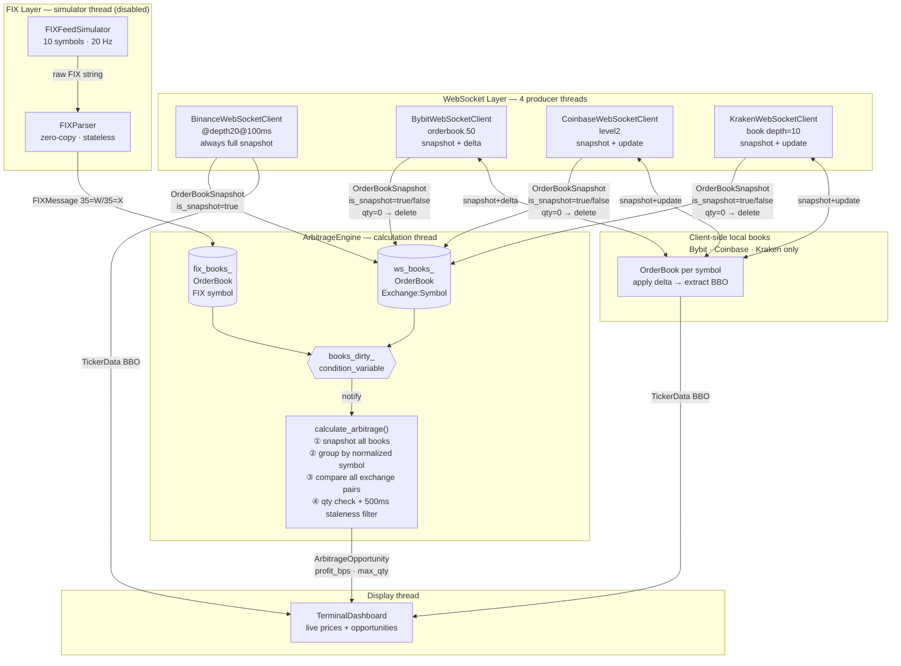

# TickPlant — Runtime Data Flow (UML)

```mermaid
flowchart TB
    subgraph WS ["WebSocket Layer — 4 producer threads"]
        BIN["BinanceWebSocketClient\n@depth20@100ms\nalways full snapshot"]
        BYB["BybitWebSocketClient\norderbook.50\nsnapshot + delta"]
        COI["CoinbaseWebSocketClient\nlevel2\nsnapshot + update"]
        KRA["KrakenWebSocketClient\nbook depth=10\nsnapshot + update"]
    end

    subgraph FIX ["FIX Layer — simulator thread  (disabled)"]
        SIM["FIXFeedSimulator\n10 symbols · 20 Hz"]
        FP["FIXParser\nzero-copy · stateless"]
        SIM -->|raw FIX string| FP
    end

    subgraph CLIENTS_LOCAL ["Client-side local books\nBybit · Coinbase · Kraken only"]
        LB["OrderBook per symbol\napply delta → extract BBO"]
    end

    subgraph ENGINE ["ArbitrageEngine — calculation thread"]
        WB[("ws_books_\nOrderBook\nExchange:Symbol")]
        FB[("fix_books_\nOrderBook\nFIX symbol")]
        CV{{"books_dirty_\ncondition_variable"}}
        CALC["calculate_arbitrage()\n① snapshot all books\n② group by normalized symbol\n③ compare all exchange pairs\n④ qty check + 500ms staleness filter"]
        WB --> CV
        FB --> CV
        CV -->|notify| CALC
    end

    subgraph DISPLAY ["Display thread"]
        DASH["TerminalDashboard\nlive prices + opportunities"]
    end

    BIN -->|"OrderBookSnapshot\nis_snapshot=true"| WB
    BYB -->|"OrderBookSnapshot\nis_snapshot=true/false\nqty=0 → delete"| WB
    COI -->|"OrderBookSnapshot\nis_snapshot=true/false\nqty=0 → delete"| WB
    KRA -->|"OrderBookSnapshot\nis_snapshot=true/false\nqty=0 → delete"| WB

    BYB <-->|"snapshot+delta"| LB
    COI <-->|"snapshot+update"| LB
    KRA <-->|"snapshot+update"| LB
    LB  -->|"TickerData BBO"| DASH

    FP  -->|"FIXMessage 35=W/35=X"| FB

    BIN -->|"TickerData BBO"| DASH
    CALC -->|"ArbitrageOpportunity\nprofit_bps · max_qty"| DASH
```
