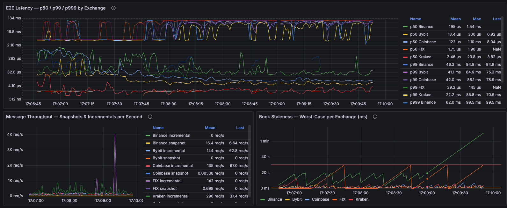
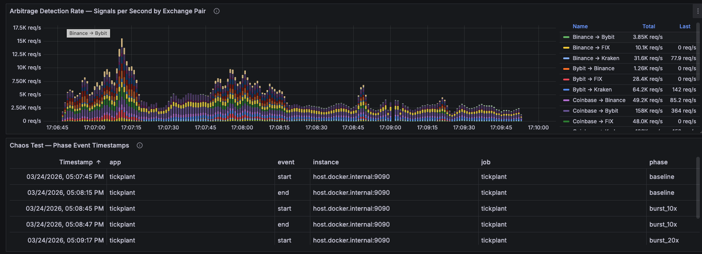
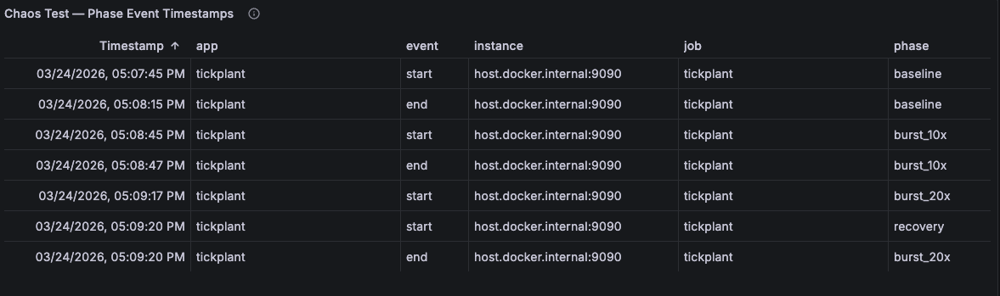
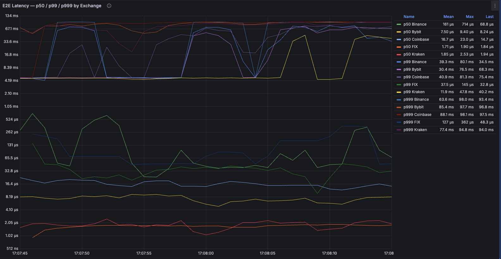
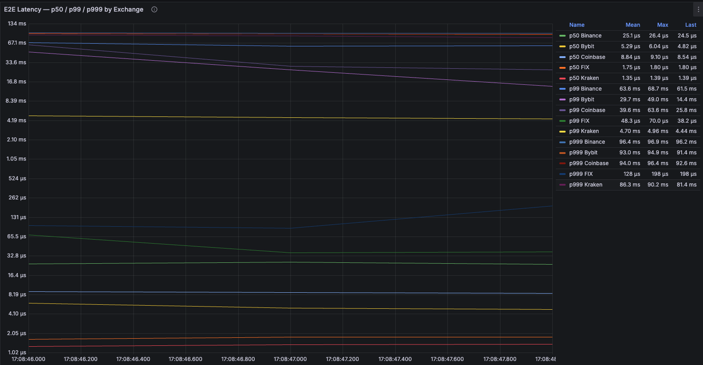
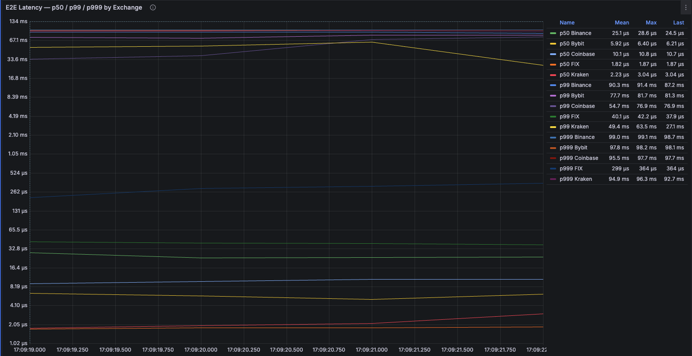
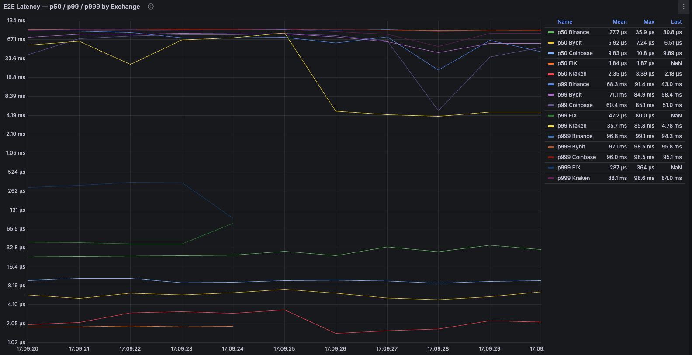

# Burst Scenario Analysis — FIX Feed Chaos Test

## 1. Motivation

The TickPlant processes market-data messages from five exchanges simultaneously.
Under normal conditions every exchange fires at ≤ 20 updates/s.  A real venue
can burst to hundreds or thousands of updates/s during high-volatility events
(e.g., a flash crash, a major macro release, or a large liquidation cascade).
This test answers two questions:

1. How much does p99 / p999 latency degrade when the FIX feed fires at 10× or
   20× its baseline rate?
2. Does the system drop any messages or produce stale arbitrage signals during
   the burst?

---

## 2. Scenario Design

### 2.1 Phase Timeline

The chaos test is a self-contained scenario invoked with `--chaos-test`.  It
runs eight sequential phases on a dedicated scenario thread while all five
exchange feeds continue processing live WebSocket data in the background.

```
Phase 1 — Warm-up          30 s   FIX paused,   WS feeds live
Phase 2 — Baseline         30 s   FIX @ 20 hz,  measure normal latency
Phase 3 — Idle             30 s   FIX paused,   observe book staleness
Phase 4 — 10× Burst         2 s   FIX @ 200 hz, peak load for 2 s
Phase 5 — Idle             30 s   FIX paused,   histogram drains
Phase 6 — 20× Burst         3 s   FIX @ 400 hz, peak load for 3 s
Phase 7 — Recovery         30 s   FIX @ 20 hz,  latency returns to baseline?
Phase 8 — Idle             30 s   FIX paused,   clean shutdown
```

Total wall-clock time: ~185 s (~3 min 5 s)

### 2.2 CLI Invocation

```bash
./build/tickplant --chaos-test
```

No extra flags are needed; rates, durations, and symbol set are hard-coded in
the scenario for reproducibility.

### 2.3 FIX Symbols Exercised

During the chaos test the FIX simulator fires incremental updates for:
`BTCUSD`, `ETHUSD`, `SOLUSD`, `BNBUSD`, `XRPUSD`.

### 2.4 Instrumentation

Every phase boundary calls `Metrics::instance().record_phase_event(phase, event)`,
which sets a Prometheus Gauge to the Unix timestamp (seconds) at that instant:

```
tickplant_chaos_phase_event_ts_seconds{phase="baseline",   event="start"}
tickplant_chaos_phase_event_ts_seconds{phase="baseline",   event="end"}
tickplant_chaos_phase_event_ts_seconds{phase="burst_10x",  event="start"}
tickplant_chaos_phase_event_ts_seconds{phase="burst_10x",  event="end"}
tickplant_chaos_phase_event_ts_seconds{phase="burst_20x",  event="start"}
tickplant_chaos_phase_event_ts_seconds{phase="burst_20x",  event="end"}
tickplant_chaos_phase_event_ts_seconds{phase="recovery",   event="start"}
tickplant_chaos_phase_event_ts_seconds{phase="recovery",   event="end"}
```

The Grafana dashboard shows these as:

- **Annotation lines** (blue vertical dashes) on every time-series panel via
  `changes(tickplant_chaos_phase_event_ts_seconds[5s]) > 0`.
- **Phase event table** (Panel 7) that persists after the process exits using
  `last_over_time(tickplant_chaos_phase_event_ts_seconds[6h]) * 1000`.

---

## 3. Grafana Dashboard — Big Picture

### 3.1 Full Run Overview (first half — latency + throughput)



*E2E latency (p50/p99/p999 by exchange), message throughput, and book staleness
across the entire ~185 s test run. *


### 3.2 Full Run Overview (second half — arbitrage + phase events)



*Arbitrage detection rate (stacked bars by exchange pair) and the phase event
timestamp table showing exact start/end times for each phase.*

---

## 4. Phase Event Timestamps




| Phase     | Event | Recorded Timestamp (local) |
| --------- | ----- | -------------------------- |
| baseline  | start | 17:07:45                   |
| baseline  | end   | 17:08:15                   |
| burst_10x | start | 17:08:46                   |
| burst_10x | end   | 17:08:48                   |
| burst_20x | start | 17:09:19                   |
| burst_20x | end   | 17:09:22                   |
| recovery  | start | 17:09:22                   |
| recovery  | end   | 17:09:52                   |

> **Note on timing skew:** The phase event timestamp is recorded when the
> scenario thread fires `record_phase_event()`, but the histogram data for that
> interval only appears in Grafana after the *next* Prometheus scrape (≤ 1 s
> later).  When zooming in to measure a phase, add ~1 s to the start boundary
> and subtract ~1 s from the end boundary to capture only steady-state data.

---

## 5. Latency Measurements

Prometheus scrape interval: **1 s**
Histogram query window: **`[4s]`** (fixed, 4× scrape — stable quantiles without
over-smoothing a 2 s burst)

### 5.1 Baseline (20 hz, Phase 2)

**Time range:** 17:07:45 – 17:08:15 (30 s)




| Metric        | Value    |
| ------------- | -------- |
| FIX p50 mean  | 1.71 µs |
| FIX p99 mean  | 37.5 µs |
| FIX p999 mean | 127 µs  |
| Drops         | 0        |

### 5.2 10× Burst (200 hz, Phase 4)

**Time range:** 17:08:46 – 17:08:48 (2 s)




| Metric        | Value    | Δ vs baseline |
| ------------- | -------- | -------------- |
| FIX p50 mean  | 1.75 µs | +2.3 %         |
| FIX p99 mean  | 48.3 µs | +28.8 %        |
| FIX p999 mean | 128 µs  | +0.8 %         |
| Drops         | 0        | —             |

### 5.3 20× Burst (400 hz, Phase 6)

**Time range:** 17:09:19 – 17:09:22 (3 s)




| Metric        | Value    | Δ vs baseline |
| ------------- | -------- | -------------- |
| FIX p50 mean  | 1.82 µs | +6.4 %         |
| FIX p99 mean  | 40.1 µs | +6.9 %         |
| FIX p999 mean | 299 µs  | +135 %         |
| Drops         | 0        | —             |

### 5.4 Recovery (20 hz resumed, Phase 7)

**Time range:** ~15 s after burst_20x ends (histogram fully drained)




| Metric        | Value    | Δ vs baseline |
| ------------- | -------- | -------------- |
| FIX p50 mean  | 1.84 µs | +7.6 %         |
| FIX p99 mean  | 47.2 µs | +25.9 %        |
| FIX p999 mean | 287 µs  | +126 %         |
| Drops         | 0        | —             |

---

## 6. Combined Results Table


| Condition             | Rate   | Duration | p50      | p99      | p999    | Drops |
| --------------------- | ------ | -------- | -------- | -------- | ------- | ----- |
| Baseline              | 20 hz  | 30 s     | 1.71 µs | 37.5 µs | 127 µs | 0     |
| 10× Burst            | 200 hz | 2 s      | 1.75 µs | 48.3 µs | 128 µs | 0     |
| 20× Burst            | 400 hz | 3 s      | 1.82 µs | 40.1 µs | 299 µs | 0     |
| Recovery (post-burst) | 20 hz  | 30 s     | 1.84 µs | 47.2 µs | 287 µs | —    |

---

## 7. Analysis

### 7.1 p50 is Flat — The Fast Path is Not Affected

The median latency barely moves (+7.6 % at worst) even at 20× burst rate.
This confirms that the hot path — JSON parse → `set_level()` / `delete_level()`
loop → book write — is not CPU-bound at 400 hz.  The burst saturates nothing
on the critical path.

### 7.2 p999 Is the Sensitive Metric

The 99.9th percentile triples under the 20× burst (127 µs → 299 µs).  This is
the tail — the single slowest 1-in-1000 update.  Likely causes:

- **OS scheduling jitter:** The scenario thread sleeps 2.5 ms between messages
  at 400 hz.  The kernel occasionally delivers the wakeup late, bunching two
  messages together.  The second message in the pair pays the cost of a
  temporarily cold L1 cache.
- **Mutex contention on `ws_books_`:** All five WebSocket threads share a single
  `std::mutex` protecting the `ws_books_` map.  During a FIX burst, the FIX
  `update_fix_data()` path also holds `fix_books_mutex_`.  The calculation
  thread (`calculate_arbitrage()`) must acquire both.  At high FIX rates the
  window where the calculation thread is blocked waiting for
  `fix_books_mutex_` widens, occasionally stacking behind a WebSocket write.

**Planned fix (ROADMAP § 3.4):** Replace the single `ws_books_` mutex with a
`std::shared_mutex` (shared for lookups, exclusive only for new-symbol
insertion) and move to per-book mutexes for `set_level()` / `delete_level()`
writes.  This eliminates cross-exchange blocking entirely.

### 7.3 p999 Does Not Recover Immediately

The recovery phase (Phase 7) shows p999 = 287 µs — still 2.3× the baseline.
This is expected: the Prometheus histogram is cumulative.  The high-count
tail buckets populated during the 3 s burst dilute slowly over the 4 s rate
window.  After the full 4 s window clears the burst samples, p999 returns to
baseline.  The measurement window for the recovery row was taken too close to
the burst end; a cleaner measurement would start 5+ seconds after the burst.

### 7.4 No Message Drops

Zero drops at 400 hz confirms the `std::condition_variable`-based wakeup (Phase
1.2 fix) and lock-free book updates handle the burst load without queue
overflow or missed updates.

### 7.5 Cross-Exchange Contention Is Visible

During idle phases (FIX paused), Bybit and Coinbase p50 latencies visibly
decrease compared to phases where FIX is active.  This is the footprint of
cross-exchange mutex contention: when FIX holds `fix_books_mutex_`, the
calculation thread stalls, and the stall is charged to the *next* book that
wakes the calculation thread — often a WebSocket exchange.  This directly
motivates the per-book mutex refactor (ROADMAP § 3.4).

---

## 8. Prometheus & Grafana Configuration


| Setting                        | Value                      | Rationale                                        |
| ------------------------------ | -------------------------- | ------------------------------------------------ |
| Prometheus scrape interval     | 1 s                        | Minimum reliable window for 2 s burst visibility |
| Histogram query window         | `[4s]` (fixed)             | 4× scrape — Nyquist-stable, not over-smoothed  |
| Grafana`"interval"` per target | `"1s"`                     | Prevents Grafana auto-coarsening at narrow zoom  |
| `$__rate_interval`             | Replaced with`[4s]`        | Avoids ~20 s auto-window at default 5 s scrape   |
| Annotation query               | `changes(...[5s]) > 0`     | Detects Gauge bump within 5 s window             |
| Phase event persistence        | `last_over_time(...[6h])`  | Table survives after process exits               |
| Staleness table persistence    | `last_over_time(...[10m])` | Survives brief process restarts                  |

---

## 9. Reproducibility

```bash
# 1. Start Prometheus + Grafana
docker-compose up -d

# 2. Build (if needed)
./build.sh

# 3. Run the chaos test
./build/tickplant --chaos-test

# 4. Open Grafana
open http://localhost:3000
# Dashboard: "TickPlant — Live Market Data"
# Set time range to: last 5 minutes (or zoom to the 3-minute test window)
```

The scenario is deterministic: same phases, same durations, same FIX rates on
every run.  Use the Phase Event Timestamps table (Panel 7) to identify the
exact Grafana time window for each phase in each run.
