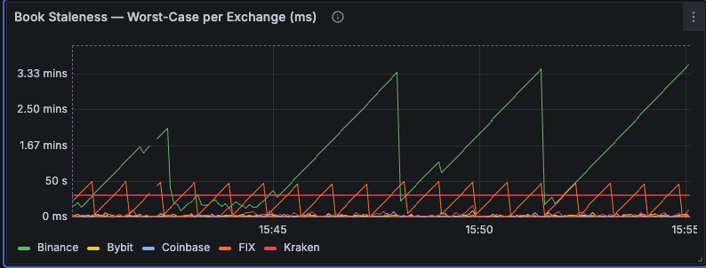
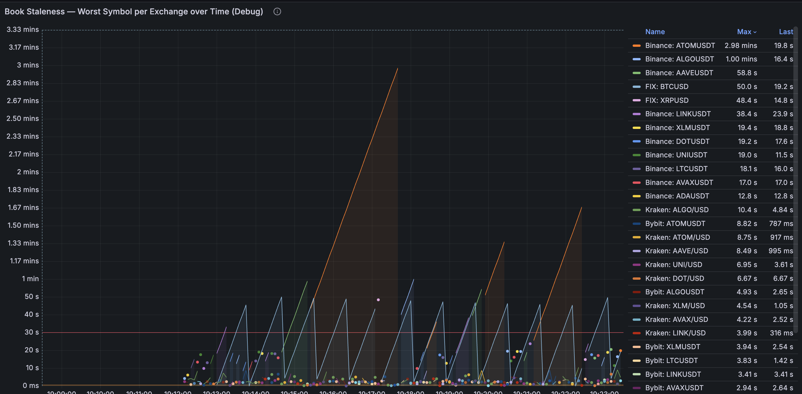

# Staleness problem



We can observe an abnormal green triangle ramp (Binance) from the latency plot.

To further check, if there is a bug of grafana dashboard, I used curl to check metrics:

```
curl -s http://localhost:9090/metrics
```

The results shows that staleness of binance for are indeed larger than the other three exchanges.

To futher debug whether there is a single symbol that contribute to this large staleness, I expose the maximum staleness and its corresponding symbol and show it on grafana.



It seems like all exchanges and their different symbols suffer from low lilquidity.
